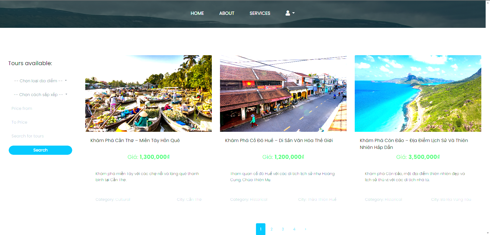

# Đồ Án: Hệ Thống Đặt Tour Du Lịch

## Giới thiệu
Đây là đồ án hệ thống **Đặt Tour Du Lịch** được xây dựng với mục đích ứng dụng các công nghệ hiện đại trong phát triển phần mềm, đặc biệt là việc sử dụng **ASP.NET Core MVC 8** để xây dựng một ứng dụng web đặt tour du lịch. Hệ thống cho phép khách hàng tìm kiếm, đặt tour, quản lý thông tin khách hàng, nhân viên, tour, và các chức năng khác. 

Hệ thống này bao gồm các chức năng chính:
- Tìm kiếm tour du lịch theo địa điểm, giá cả, loại hình.
- Đặt tour trực tuyến.
- Quản lý thông tin khách hàng, lịch sử đặt tour và phản hồi.
- Quản lý tour, địa điểm, khách sạn, phân công nhân viên cho các tour.
- Hệ thống thanh toán và quản lý các đơn đặt tour.

## Công nghệ sử dụng
Dự án được phát triển bằng các công nghệ sau:

- **ASP.NET Core MVC 8**: Là framework mạnh mẽ của Microsoft dùng để xây dựng các ứng dụng web với mô hình MVC (Model-View-Controller). Được tối ưu hóa cho hiệu suất và hỗ trợ đa nền tảng (Windows, Linux, macOS).
- **Entity Framework Core**: Thư viện ORM (Object-Relational Mapping) giúp kết nối ứng dụng với cơ sở dữ liệu SQL Server một cách dễ dàng và hiệu quả.
- **SQL Server**: Được sử dụng làm hệ quản trị cơ sở dữ liệu (DBMS) để lưu trữ thông tin liên quan đến khách hàng, tour, bookings, feedback, và các đối tượng khác.
- **Bootstrap 4 và 5**: Được sử dụng để xây dựng giao diện người dùng, đảm bảo giao diện đẹp và tương thích với mọi thiết bị (responsive design).
- **jQuery**: Được sử dụng trong một số tính năng tương tác động trên trang web.
  
## Các thư viện và công cụ tích hợp
Dưới đây là các thư viện và công cụ được tích hợp trong dự án:

- **ASP.NET Core Identity**: Để quản lý và xác thực người dùng, bao gồm các chức năng đăng ký, đăng nhập, phân quyền người dùng.
- **Bootstrap 5**: Thư viện CSS giúp xây dựng giao diện người dùng thân thiện và dễ sử dụng với các component như buttons, navigation bars, forms, v.v.
- **Entity Framework Core**: Thư viện ORM mạnh mẽ để kết nối ứng dụng với cơ sở dữ liệu.
- **jQuery**: Thư viện JavaScript giúp xây dựng các tính năng tương tác động như hiệu ứng, kiểm tra dữ liệu form, v.v.
- **SQL Server**: Hệ quản trị cơ sở dữ liệu cho phép lưu trữ và quản lý thông tin.
## Các Giao Diện Demo

### 1. **Giao diện Trang Chủ**
Trang chủ cung cấp cái nhìn tổng quan về các dịch vụ tour du lịch và cho phép người dùng dễ dàng tìm kiếm các tour theo các tiêu chí khác nhau.


### 2. **Giao diện Danh Sách Tour**
Danh sách các tour hiện có, cho phép người dùng lựa chọn các tour mà họ quan tâm, xem thông tin chi tiết về tour.



### 3. **Giao diện Đặt Tour**
Giao diện cho phép người dùng điền thông tin và hoàn tất việc đặt tour, bao gồm các chi tiết như số lượng người lớn, trẻ em và thông tin thanh toán.


### 4. **Giao diện Quản Lý Tour (Admin)**
Giao diện quản lý dành cho quản trị viên, cho phép thêm, sửa, xóa thông tin về các tour, khách sạn, địa điểm, v.v.


### 5. **Giao diện Quản Lý Khách Hàng**
Giao diện quản lý khách hàng giúp admin có thể quản lý thông tin người dùng và các đơn đặt tour của khách hàng.


### 6. **Giao diện Đánh Giá Tour**
Khách hàng có thể đánh giá và để lại nhận xét về các tour mà họ đã tham gia.

  
## Cài đặt và Chạy Dự Án

1. **Cài đặt .NET Core SDK**:
    - Tải và cài đặt [SDK .NET Core 8](https://dotnet.microsoft.com/download/dotnet/8.0).
  
2. **Clone Repository**:
    - Clone dự án từ GitHub:
    ```bash
    git clone https://github.com/NguyenMinhKiet/BookingTour.git
    ```

3. **Cài đặt các gói NuGet**:
    - Trong Visual Studio, mở dự án và tải các gói NuGet bằng cách chọn `Tools` -> `NuGet Package Manager` -> `Package Manager Console` và gõ:
    ```bash
    Install-Package Microsoft.EntityFrameworkCore.SqlServer
    Install-Package Microsoft.AspNetCore.Identity.EntityFrameworkCore
    Install-Package Microsoft.EntityFrameworkCore.Tools
    ```

4. **Cấu hình Cơ sở Dữ Liệu**:
    - Cập nhật chuỗi kết nối trong tệp `appsettings.json` để kết nối với cơ sở dữ liệu SQL Server.
    - Chạy migration để tạo các bảng trong cơ sở dữ liệu:
    ```bash
    dotnet ef database update
    ```

5. **Chạy Dự Án**:
    - Để chạy ứng dụng, sử dụng lệnh sau trong Visual Studio hoặc dòng lệnh:
    ```bash
    dotnet run
    ```

6. **Truy cập ứng dụng**:
    - Mở trình duyệt và truy cập địa chỉ `http://localhost:7031` để bắt đầu sử dụng hệ thống.

## Tính Năng Chính

- **Đặt Tour**: Cho phép khách hàng tìm kiếm và đặt các tour du lịch theo các tiêu chí như địa điểm, giá cả và loại tour.
- **Quản lý Người Dùng**: Quản lý thông tin người dùng, cho phép phân quyền cho các nhân viên quản trị và khách hàng.
- **Thanh Toán**: Quản lý thanh toán cho các đơn đặt tour.
- **Quản lý Tour**: Cho phép quản trị viên thêm, sửa, xóa các tour, địa điểm và khách sạn.
- **Đánh Giá Tour**: Khách hàng có thể thêm đánh giá và phản hồi về các tour đã tham gia.

## Liên Hệ

Nếu bạn có bất kỳ câu hỏi nào hoặc muốn đóng góp cho dự án, vui lòng liên hệ với tôi qua:
- Email: [nguyenminhkiet@example.com](mailto:nguyenminhkiet@example.com)
- GitHub: [https://github.com/username](https://github.com/username)

